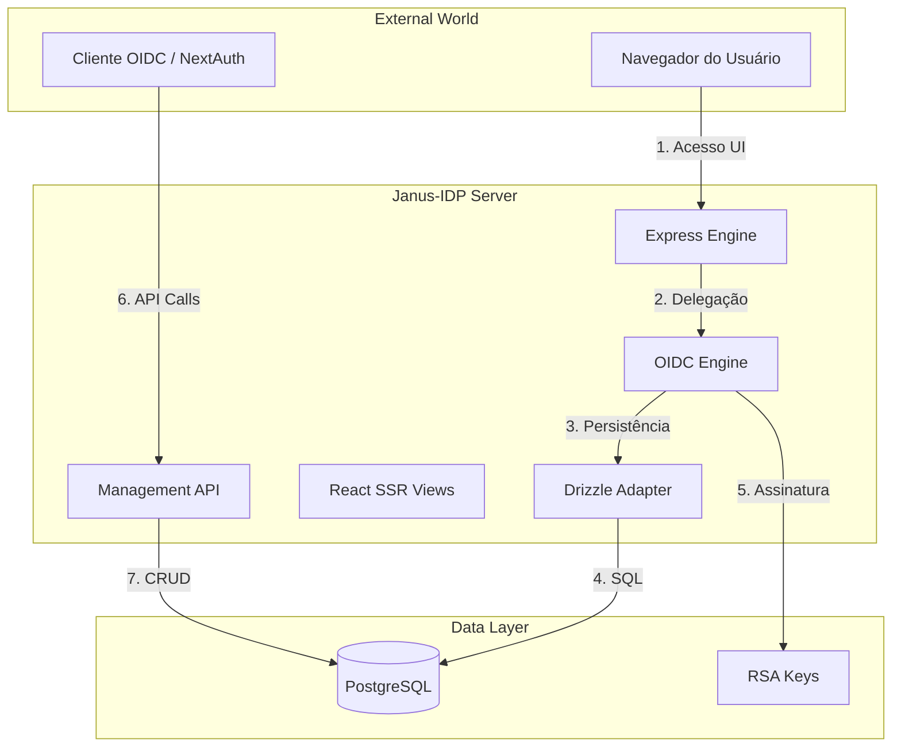
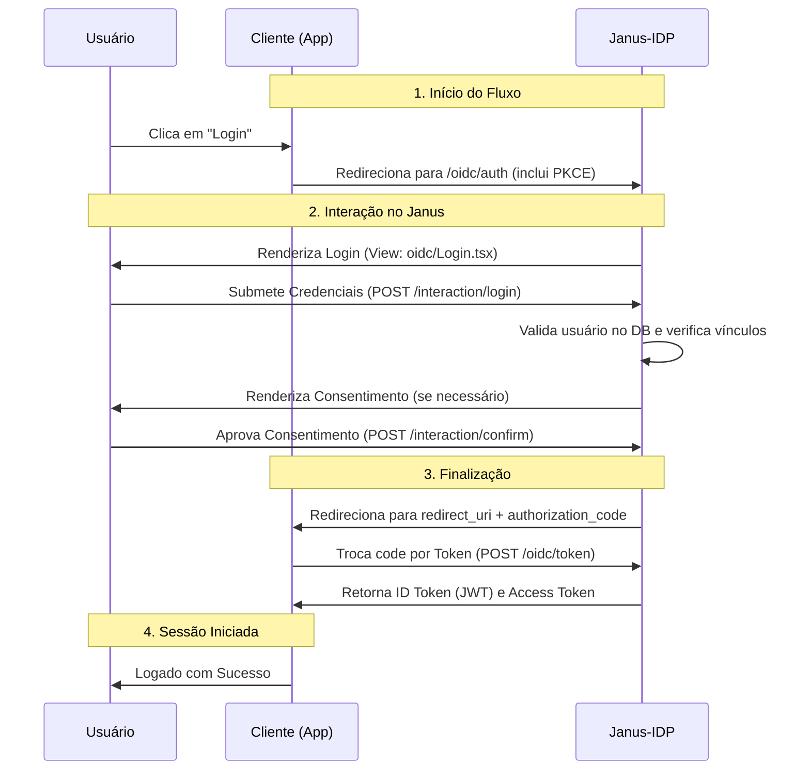

# Arquitetura do Sistema

O Janus-IDP é um ecossistema de autenticação e autorização projetado para ser o nó central de confiança. Ele é construído sobre a engine `oidc-provider`, o que garante conformidade com as normas do **OpenID Foundation**.

## Componentes do Sistema



## Fluxo de Autenticação (Authorization Code)

O Janus implementa o fluxo mais seguro do OIDC, garantindo que credenciais nunca toquem o cliente.



## Estratégia de Autorização (Claims)

O Janus utiliza um modelo de **Autorização Descentralizada**. Ele não toma decisões de acesso para os clientes, mas entrega a "verdade" sobre o usuário.

1. **Claims**: Ao emitir um `id_token`, o Janus inclui uma claim customizada chamada `roles`.
2. **Formato do Contrato**:
   ```json
   {
     "roles": {
       "global": ["janus_admin"],
       "client": [
         { "code": "editor", "clientId": "ux-auditor" }
       ]
     }
   }
   ```
3. **Decisão Local**: O cliente (ex: uma aplicação Next.js) recebe este objeto e decide, localmente, se o usuário pode acessar determinada rota `/admin`.

## SSR e Hydration

A interface do Janus (login, consentimento, dashboard admin) é renderizada no servidor para:
- **Segurança**: Credenciais processadas no servidor.
- **Performance**: FCP (First Contentful Paint) imediato.
- **SEO/Audit**: Facilidade de rastreamento.

Após o carregamento inicial, o React "hidrata" o cliente para permitir interatividade sem recarregar a página inteiramente em transições administrativas.

## Escalabilidade e Stateless

O Janus é majoritariamente **stateless**. 
- Todo o estado de sessões e grants reside no banco de dados via `OidcPayload`.
- Isso permite que você escale o número de réplicas do container `janus-idp` horizontalmente atrás de um Load Balancer sem perder sessões ativas.
