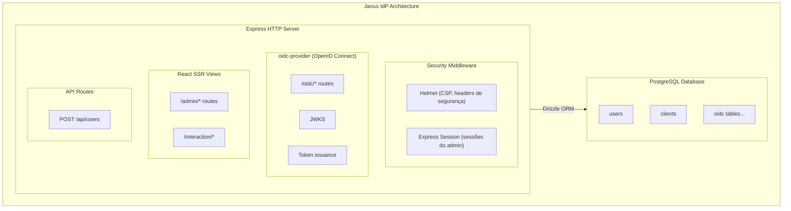
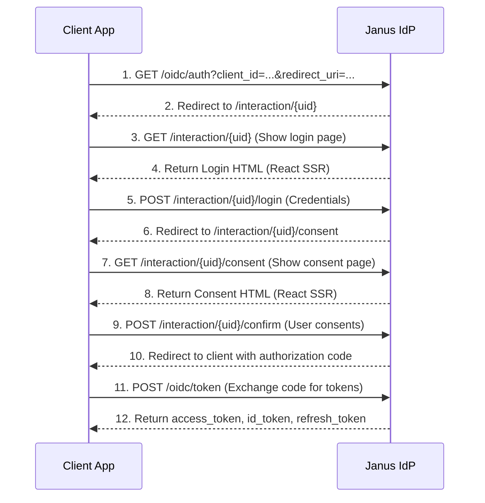

# Arquitetura do Janus IdP

## Visão Geral

O Janus IdP é um Identity Provider OpenID Connect implementado com uma arquitetura modular moderna. O sistema consiste em um servidor HTTP (Express) que integra o provedor `oidc-provider`, um banco de dados PostgreSQL para persistência, e uma interface administrativa construída com React SSR.



## Estrutura do Projeto

```
janus-idp/
├── src/
│   ├── adapter.ts          # Adapter do Drizzle para oidc-provider
│   ├── index.ts            # Entry point principal do servidor
│   ├── middleware/
│   │   └── auth.ts         # Middlewares de autenticação
│   ├── routes/
│   │   ├── admin.ts        # Rotas do portal administrativo
│   │   ├── api.ts          # Rotas da API externa
│   │   └── interaction.ts  # Rotas de interação OIDC
│   ├── services/
│   │   └── account.ts      # Serviço de contas de usuário
│   ├── utils/
│   │   └── keys.ts         # Gerenciamento de chaves RSA
│   ├── views/              # Componentes React para SSR
│   │   ├── admin/          # Views do portal admin
│   │   ├── oidc/           # Views OIDC (login, consent)
│   │   └── components/     # Componentes compartilhados
│   ├── client/
│   │   └── index.tsx       # Entry point client-side (hydration)
│   ├── db/
│   │   ├── index.ts        # Conexão com PostgreSQL
│   │   └── schema.ts       # Definição de schemas Drizzle
│   └── types/
│       └── express.ts      # Tipos TypeScript para Express
├── drizzle/
│   └── seed.ts             # Script de seed do banco
├── public/
│   └── dist/               # Bundle client-side gerado pelo Vite
├── Dockerfile              # Imagem Docker multi-stage
├── docker-compose.yml      # Orquestração dos containers
├── drizzle.config.ts       # Configuração do Drizzle Kit
├── tsconfig.json           # Configuração TypeScript
├── vite.config.ts          # Configuração do Vite
└── package.json
```

## Componentes Principais

### 1. Express HTTP Server ([`src/index.ts`](src/index.ts:1))

O servidor Express é o ponto de entrada da aplicação e configura:

- **Middlewares de segurança**: Helmet para headers de segurança e CSP
- **Sessões**: Express session para autenticação do portal admin
- **Rotas estáticas**: Arquivos estáticos do bundle client-side
- **Rotas OIDC**: Providas pelo `oidc-provider` no caminho `/oidc`
- **Rotas de interação**: Login e consentimento OIDC
- **Rotas admin**: Portal administrativo em `/admin`
- **Rotas API**: Endpoints REST para serviços externos

### 2. OIDC Provider ([oidc-provider](https://github.com/panva/node-oidc-provider))

O `oidc-provider` é um middleware Express que implementa o protocolo OpenID Connect. Configurações principais:

- **Adapter**: [`DrizzleAdapter`](src/adapter.ts:1) - Integração com PostgreSQL via Drizzle ORM
- **JWKS**: Endpoint público para chaves de verificação de assinatura
- **Clients**: Carregados dinamicamente do banco de dados
- **Scopes**: Suporte dinâmico a escopos baseado nos clientes registrados
- **PKCE**: Proof Key for Code Exchange (obrigatório para authorization_code flow)
- **Features**: Introspection e revocation habilitados

### 3. Drizzle ORM ([`src/db/`](src/db/))

Gerenciamento do banco de dados com Drizzle ORM:

- **Schema**: [`schema.ts`](src/db/schema.ts:1) - Definição das tabelas
  - `users`: Usuários do sistema
  - `clients`: Clientes OAuth/OIDC
  - `oidc_*`: Tabelas gerenciadas pelo adapter OIDC
- **Index**: [`index.ts`](src/db/index.ts:1) - Conexão com PostgreSQL
- **Seed**: [`drizzle/seed.ts`](drizzle/seed.ts:1) - Criação de dados iniciais

### 4. React SSR Components ([`src/views/`](src/views/))

Interface administrativa e páginas OIDC usando React com Server-Side Rendering:

- **Renderização**: `renderToString` no servidor para HTML inicial
- **Hydration**: `hydrateRoot` no client para interatividade
- **Views Admin**: Dashboard, Clients, Users
- **Views OIDC**: Login, Consent, Error
- **Componentes**: Layout, Button, Card, Input, Table

### 5. Client-Side Bundle ([`src/client/`](src/client/index.tsx:1))

Bundle compilado pelo Vite para hidratação client-side:

- Lê dados de hidratação do DOM
- Importa componentes dinamicamente
- Hidrata o HTML renderizado no servidor
- Habilita interatividade das views

## Fluxo de Autenticação OIDC



## Fluxo de Inicialização

Ao iniciar o servidor ([`init.sh`](init.sh:1) → [`src/index.ts`](src/index.ts:1)):

1. **Env Load**: Carrega variáveis de ambiente do `.env`
2. **Database Connection**: Estabelece conexão com PostgreSQL
3. **Load Clients**: Busca todos os clientes do banco de dados
4. **Extract Scopes**: Extrai escopos únicos dos clientes
5. **Load RSA Keys**: Gera ou carrega chaves RS256 para assinatura
6. **Configure Provider**: Configura o oidc-provider
7. **Setup Routes**: Configura rotas Express
8. **Start Listener**: Inicia servidor HTTP na porta configurada

## Segurança

### Headers de Segurança

- **Content Security Policy**: Configurado via Helmet
  - `defaultSrc`: `'self'`
  - `styleSrc`: `'self' 'unsafe-inline'` (para Tailwind)
  - `scriptSrc`: `'self' cdn.tailwindcss.com 'unsafe-inline'`
  - `imgSrc`: `'self' data: https:`
  - `connectSrc`: `'self'`

### Hash de Senhas

- Senhas com hash usando **bcrypt** com 12 rounds (usuário admin)
- Senhas com hash usando **bcrypt** com 10 rounds (API)

### Token Signing

- **Algoritmo**: RS256 (RSA Signature with SHA-256)
- **Chaves**: Geradas automaticamente ou configuradas via ambiente
- **Public Key**: Exposta no endpoint `/oidc/jwks`

### Autenticação Admin

- Sessões armazenadas via `express-session`
- Cookie `httpOnly` para prevenção de XSS
- Timeout de 24 horas

### API Key

- Serviços externos autenticados via header `X-Service-Key`
- Chave configurada via `JANUS_SERVICE_API_KEY`

## Docker Multi-Stage Build

O Dockerfile usa uma estratégia de multi-stage build para otimizar o tamanho da imagem:

1. **Stage 1 (dependencies)**: Instala node_modules
2. **Stage 2 (builder)**: Compila TypeScript e bundle client-side
3. **Stage 3 (production)**: Imagem otimizada com apenas o necessário

Volumes:
- `janus-postgres-data`: Persistência do banco de dados
- `janus-rsa-keys`: Persistência das chaves RSA

Rede:
- `ux-auditor-network`: Rede externa para comunicação com outros serviços

## Scripts disponíveis

Comando | Descrição |
--------|-----------|
`npm run dev` | Modo desenvolvimento com hot reload |
`npm run build` | Build do servidor (TypeScript) e do cliente (Vite) |
`npm run build:server` | Build TypeScript apenas |
`npm run build:client` | Build do bundle client-side com Vite |
`npm run start` | Inicia servidor (produção) |
`npm run db:generate` | Gera migrations Drizzle |
`npm run db:push` | Sincroniza schema com o banco (push) |
`npm run db:migrate` | Executa migrations |
`npm run db:seed` | Popula banco com dados iniciais |
`npm run db:studio` | Abre Drizzle Studio (interface visual) |
`npm run generate-keys` | Gera novo par de chaves RSA |
