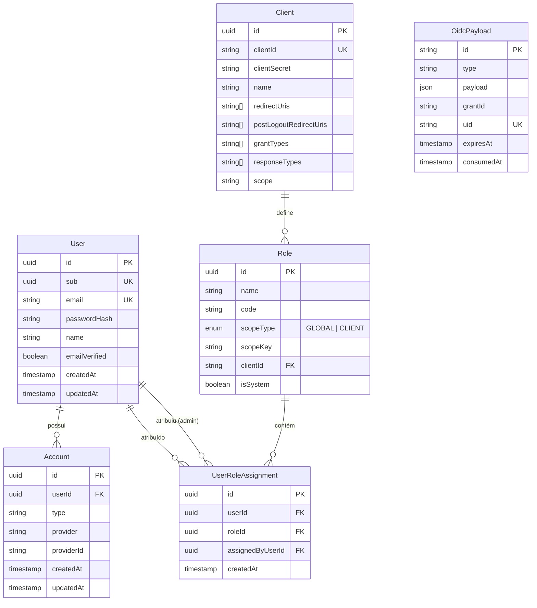

# Arquitetura de Banco de Dados

O Janus-IDP utiliza **PostgreSQL** como motor de persistência e **Drizzle ORM** para mapeamento objeto-relacional (ORM). A modelagem foi projetada para suportar tanto os dados canônicos do provedor OIDC quanto a gestão de usuários e controle de acesso baseado em papéis (RBAC).

## Diagrama de Entidade-Relacionamento (ERD)

## Detalhamento das Tabelas

### 1. `User`
Armazena as informações centrais do usuário. 
- **`sub` (Subject Identifier)**: Identificador único e imutável exposto via OIDC. É o "contrato" de identidade com os clientes.
- **`passwordHash`**: Armazenado utilizando Bcrypt.

### 2. `Account`
Permite a vinculação de múltiplas contas de login (Locais ou Sociais futuramente) ao mesmo `User`.
- Atualmente suporta o provedor `local`.

### 3. `Client`
Configurações dos clientes OAuth2/OIDC registrados no sistema.
- **`clientId` / `clientSecret`**: Credenciais de acesso do cliente.
- **`redirectUris`**: Lista branca de URLs para onde o Janus pode redirecionar após a autenticação.

### 4. `Role`
Define os papéis de acesso no sistema.
- **`scopeType`**: 
    - `GLOBAL`: Papéis que valem para todo o ecossistema (ex: `janus_admin`).
    - `CLIENT`: Papéis específicos de um cliente (ex: `editor` no cliente `ux-auditor`).
- **`scopeKey`**: Usado para indexação rápida do escopo (ID do cliente ou literal 'global').

### 5. `UserRoleAssignment`
Tabela de ligação (many-to-many) entre usuários e papéis.
- Rastreia quem atribuiu o papel (`assignedByUserId`) para fins de auditoria.

### 6. `OidcPayload`
Tabela técnica utilizada pelo `DrizzleAdapter` para persistir o estado do `oidc-provider`.
- Armazena: `Sessions`, `AccessTokens`, `RefreshTokens`, `AuthorizationCodes`, `Grants`, etc.
- O campo `payload` contém o JSON completo serializado pelo motor OIDC.

## Índices e Performance

O banco utiliza índices estratégicos para garantir baixa latência em fluxos de autenticação:
- Índices únicos em `email`, `sub` e `clientId`.
- Índices compostos em `OidcPayload` para busca rápida por `uid` e limpeza de tokens expirados (`expiresAt`).
- Índice em `UserRoleAssignment` para resolução rápida de permissões durante o login.

## Migrações

As migrações são geradas e aplicadas via Drizzle Kit:
- Localização: `/drizzle`
- Comando de geração: `npm run db:generate`
- Comando de aplicação: `npm run db:push` (ou via `migrate` no startup do Docker)
