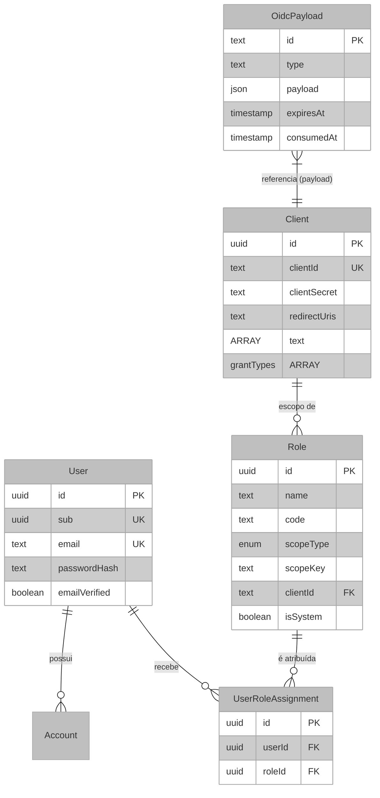

# Arquitetura e Lógica: Camada de Dados e Persistência

Este documento descreve o modelo de dados do Janus-IDP, focado na persistência de identidades, sessões e clientes OAuth 2.0.

## Visão Geral e Propósito do Banco de Dados

O banco de dados é projetado para suportar o armazenamento persistente de identidades de usuários, metadados de clientes OIDC e estados de autorização (Grants e Tokens). A modelagem utiliza o **PostgreSQL** através do **Drizzle ORM**, garantindo integridade referencial e performance em consultas complexas.

## Modelagem de Dados e Lógica de Negócio

A modelagem é dividida em cinco domínios principais:

1.  **Identidade Central (`User`):** Armazena credenciais, atributos e o `sub` estável do usuário.
2.  **Ecossistema de Clientes (`Client`):** Configurações de aplicações que podem solicitar autenticação (URIs de redirecionamento, segredos, escopos).
3.  **Catálogo de Papéis (`Role`):** Papéis globais e papéis por cliente, todos dirigidos por dados e não por enum fixo.
4.  **Atribuições de Papéis (`UserRoleAssignment`):** Tabela de relacionamento entre usuários e papéis.
5.  **Estado do Provedor (`OidcPayload`):** Tabela genérica para armazenar o estado interno do motor OIDC (sessões, tokens, códigos de autorização).

## Arquitetura e Lógica de Fluxo (Data Flow)

O fluxo de dados segue um padrão de **Sincronização de Estado**, onde o motor OIDC delega a persistência ao `DrizzleAdapter`.

1.  **Input:** Requisição de Autorização via OIDC (ex: `/auth?client_id=...`).
2.  **Execução:**
    -   O OIDC Provider gera um `GrantId` ou `SessionUID`.
    -   O `DrizzleAdapter` recebe o objeto JSON e o persiste na tabela `OidcPayload`.
    -   O campo `expiresAt` é calculado dinamicamente com base no TTL (Time To Live) configurado no `src/index.ts`.
3.  **Output:** Recuperação do estado para validação de tokens ou manutenção de sessões ativas.

## Fundamentação Matemática

A gestão de expiração de payloads segue uma lógica de remoção preguiçosa (*Lazy Deletion*). Um registro é considerado inválido se:

$$ T_{	ext{atual}} > T_{	ext{expira}} $$

A integridade referencial garante que, ao remover um usuário (on delete cascade), todas as suas atribuições em `UserRoleAssignment` e `Account` sejam eliminadas, preservando a consistência do sistema.

## Parâmetros Técnicos

| Variável | Tipo | Impacto |
| :--- | :--- | :--- |
| `expiresAt` | Timestamp | Define a validade do token/sessão. Se expirado, o sistema força novo login. |
| `consumedAt` | Timestamp | Flag de segurança para impedir reuso de *Authorization Codes* (RFC 6749). |
| `grantTypes` | Array | Determina os fluxos permitidos (ex: `authorization_code`, `refresh_token`). |

## Mapeamento Tecnológico e Referências

*   **Database:** PostgreSQL.
    *   [Official Docs](https://www.postgresql.org/docs/)
*   **Drizzle ORM:** Fornece abstração sobre SQL cru.
*   **Referência Acadêmica:** Stonebraker, M., & Hellerstein, J. M. (2005). *What Goes Around Comes Around*. Publicado em "Readings in Database Systems". Trata sobre a evolução de modelos de dados relacionais para aplicações web.

## Justificativa de Escolha

O uso de um modelo de tabela genérica para payloads (`OidcPayload`) justifica-se pela flexibilidade do motor `oidc-provider`, que armazena diferentes tipos de dados (Sessões, Tokens, Grants) com estruturas JSON variadas. Isso simplifica a manutenção do banco de dados, evitando a criação de dezenas de tabelas para cada subtipo de token.
