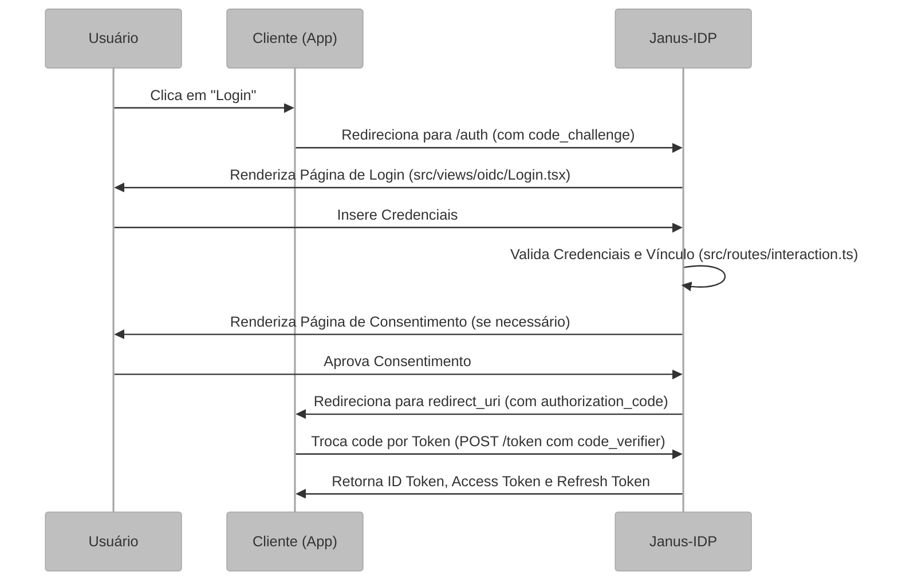

# Fundamentação do Protocolo e Fluxos OIDC

Este documento detalha o funcionamento interno do Janus-IDP como Provedor de Identidade, focando no protocolo **OpenID Connect (OIDC)** e o ciclo de vida de uma sessão de autenticação.

## Visão Geral e Propósito do Protocolo

O OpenID Connect (OIDC) estende o OAuth 2.0 para adicionar uma camada de identidade. Enquanto o OAuth foca em autorização (acesso a recursos), o OIDC permite que o Janus-IDP confirme quem é o usuário autenticado e retorne suas informações básicas (claims).

## Arquitetura e Lógica: O Fluxo de Autorização (Authorization Code)

O Janus-IDP implementa o fluxo mais seguro do OIDC, o **Authorization Code Flow** com **PKCE** (Proof Key for Code Exchange).



## Exemplo de Integração com NextAuth

Para consumidores com NextAuth, o fluxo prático é:

1. O usuário inicia o login no cliente.
2. O cliente redireciona para o Janus via `/oidc/auth`.
3. O Janus autentica o usuário e devolve `authorization_code`.
4. O cliente troca o `code` por tokens em `/oidc/token`.
5. O cliente lê as claims do `id_token` ou consulta `GET /oidc/userinfo` com o access token e decide o acesso localmente.
   O contrato canônico de autorização fica em `roles`, e o escopo necessário para recebê-lo é `profile`.

Exemplo de configuração com NextAuth:

```ts
import NextAuth from 'next-auth';

export const authOptions = {
  providers: [
    {
      id: 'janus',
      name: 'Janus',
      type: 'oidc',
      issuer: process.env.JANUS_ISSUER,
      wellKnown: `${process.env.JANUS_ISSUER}/.well-known/openid-configuration`,
      clientId: process.env.JANUS_CLIENT_ID,
      clientSecret: process.env.JANUS_CLIENT_SECRET,
      authorization: {
        params: {
          scope: 'openid profile email offline_access',
        },
      },
      checks: ['pkce', 'state'],
      profile(profile) {
        return {
          id: profile.sub,
          name: profile.name,
          email: profile.email,
          roles: profile.roles,
        };
      },
    },
  ],
  callbacks: {
    async jwt({ token, profile }) {
      if (profile) {
        token.roles = profile.roles;
      }
      return token;
    },
    async session({ session, token }) {
      session.user.roles = token.roles;
      return session;
    },
  },
};
```

No cliente, a autorização de rota fica assim:

```ts
const globalRoles = session?.user?.roles?.global ?? [];
const clientRoles = session?.user?.roles?.client ?? [];

const canEnterAdmin = globalRoles.includes('janus_admin');
const canEnterApp = clientRoles.some((role) => role.clientId === 'ux-auditor');
```

## Exemplo de Resposta no Login Bem-Sucedido

Depois que o usuário autentica e o cliente troca o `authorization_code` no endpoint `/oidc/token`, o cliente recebe os tokens OIDC e monta a sessão localmente.

Exemplo de resposta do `token endpoint`:

```json
{
  "token_type": "Bearer",
  "access_token": "eyJhbGciOiJSUzI1NiIs...",
  "id_token": "eyJhbGciOiJSUzI1NiIs...",
  "expires_in": 3600,
  "scope": "openid profile email"
}
```

Se o cliente solicitar `offline_access` e o cliente OIDC permitir `refresh_token`, também pode receber `refresh_token`:

```json
{
  "token_type": "Bearer",
  "access_token": "eyJhbGciOiJSUzI1NiIs...",
  "id_token": "eyJhbGciOiJSUzI1NiIs...",
  "refresh_token": "eyJhbGciOiJSUzI1NiIs...",
  "expires_in": 3600,
  "scope": "openid profile email offline_access"
}
```

Exemplo das claims principais expostas no `id_token` ou em `userinfo`:

```json
{
  "sub": "123e4567-e89b-12d3-a456-426614174000",
  "name": "Usuário de Exemplo",
  "email": "usuario@exemplo.com",
  "email_verified": false,
  "roles": {
    "global": ["user"],
    "client": [
      { "code": "user", "clientId": "ux-auditor" }
    ]
  }
}
```

Exemplo de resposta do `GET /oidc/userinfo`:

```json
{
  "sub": "123e4567-e89b-12d3-a456-426614174000",
  "name": "Usuário de Exemplo",
  "email": "usuario@exemplo.com",
  "email_verified": true,
  "roles": {
    "global": ["user"],
    "client": [
      { "code": "user", "clientId": "ux-auditor" }
    ]
  }
}
```

Exemplo de requisição com `curl`:

```bash
curl -H "Authorization: Bearer <access_token>" \
  http://localhost:3000/oidc/userinfo
```

No NextAuth, isso normalmente vira algo como:

```json
{
  "sub": "123e4567-e89b-12d3-a456-426614174000",
  "name": "Usuário de Exemplo",
  "email": "usuario@exemplo.com",
  "email_verified": true,
  "roles": {
    "global": ["user"],
    "client": [
      { "code": "user", "clientId": "ux-auditor" }
    ]
  }
}
```

## Fundamentação Matemática: Criptografia de Tokens (JWT)

O Janus-IDP emite tokens no formato **JWT** (JSON Web Token), assinados com a chave privada do servidor. A verificação da assinatura por parte do cliente segue a lógica:

Seja $S$ a assinatura do token e $H$ o cabeçalho concatenado com o payload. O cliente utiliza a chave pública $K_{pub}$ do Janus (disponível no endpoint `/jwks`) para validar:

$$ 	ext{Verificar}(S, H, K_{pub}) = \begin{cases} 	ext{true} & 	ext{se a assinatura for válida} \ 	ext{false} & 	ext{caso contrário} \end{cases} $$

Para o **PKCE**, o servidor valida o desafio:
$$ 	ext{code\_challenge} = 	ext{BASE64URL-ENCODE}(	ext{SHA256}(	ext{code\_verifier})) $$

## Parâmetros Técnicos e Configuração (TTL)

No arquivo `src/index.ts`, o Janus configura tempos de vida (TTL) específicos para segurança e experiência do usuário (UX):

*   **Interaction (3600s):** Tempo para o usuário completar o login/consentimento.
*   **Session (30 dias):** Duração da sessão SSO no navegador.
*   **AuthorizationCode (600s):** Janela curta para troca do código pelo token.
*   **AccessToken (3600s):** Validade curta do token de acesso por segurança.

## Mapeamento Tecnológico e Referências

*   **Implementação:** `oidc-provider`.
*   **Referência Acadêmica:** Recordon, D., & Reed, D. (2006). *OpenID 2.0: a platform for user-centric identity management*. Publicado na ACM SIGCOMM Computer Communication Review. Trata das bases da identidade descentralizada.
*   **Especificação Oficial:** [OpenID Connect Core 1.0](https://openid.net/specs/openid-connect-core-1_0.html).

## Justificativa de Escolha: Resource Indicators (RFC 8707)

O Janus-IDP utiliza a extensão **Resource Indicators** para garantir que os tokens de acesso sejam emitidos no formato **JWT** em vez de tokens opacos. Isso permite que APIs externas (Resource Servers) validem o token localmente, sem a necessidade de uma chamada de introspecção constante ao Janus, reduzindo latência e carga no servidor de identidade.

## Contrato Canônico de Claims

O Janus emite `roles` como contrato canônico de autorização em dois pontos do fluxo OIDC:

- `id_token`
- `userinfo`

O escopo necessário para receber `roles` é `profile`. O formato é exatamente:

```json
{
  "roles": {
    "global": ["user"],
    "client": [
      { "code": "user", "clientId": "ux-auditor" }
    ]
  }
}
```

Observações práticas:

- `roles.global` contém papéis globais do usuário.
- `roles.client` contém papéis do cliente que está solicitando o login.
- `offline_access` controla refresh token, não a presença de `roles`.
- O `access_token` não é o contrato canônico de autorização de UI; o cliente deve consumir `id_token` ou `userinfo`.
