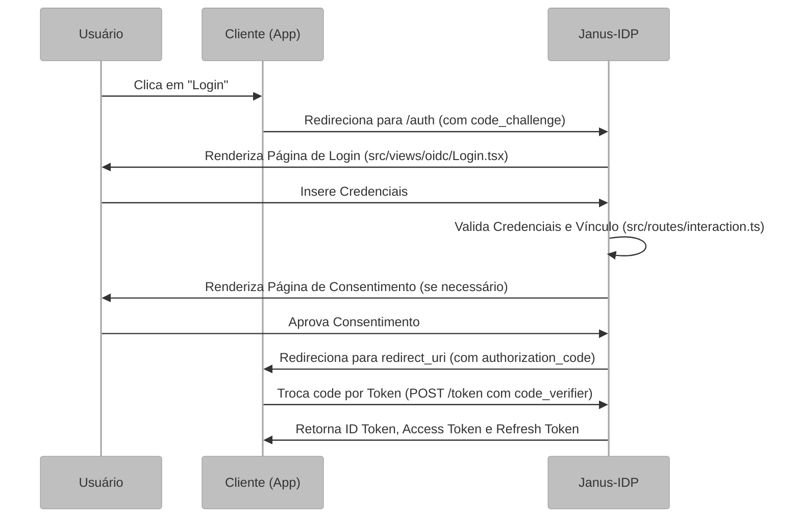

# Fundamentação do Protocolo e Fluxos OIDC

Este documento detalha o funcionamento interno do Janus-IDP como Provedor de Identidade, focando no protocolo **OpenID Connect (OIDC)** e o ciclo de vida de uma sessão de autenticação.

## Visão Geral e Propósito do Protocolo

O OpenID Connect (OIDC) estende o OAuth 2.0 para adicionar uma camada de identidade. Enquanto o OAuth foca em autorização (acesso a recursos), o OIDC permite que o Janus-IDP confirme quem é o usuário autenticado e retorne suas informações básicas (claims).

## Arquitetura e Lógica: O Fluxo de Autorização (Authorization Code)

O Janus-IDP implementa o fluxo mais seguro do OIDC, o **Authorization Code Flow** com **PKCE** (Proof Key for Code Exchange).

## Fundamentação Matemática: Criptografia de Tokens (JWT)

O Janus-IDP emite tokens no formato **JWT** (JSON Web Token), assinados com a chave privada do servidor. A verificação da assinatura por parte do cliente segue a lógica:

Seja $S$ a assinatura do token e $H$ o cabeçalho concatenado com o payload. O cliente utiliza a chave pública $K_{pub}$ do Janus (disponível no endpoint `/jwks`) para validar:

$$ 	ext{Verificar}(S, H, K_{pub}) = \begin{cases} 	ext{true} & 	ext{se a assinatura for válida} \ 	ext{false} & 	ext{caso contrário} \end{cases} $$

Para o **PKCE**, o servidor valida o desafio:
$$ 	ext{code\_challenge} = 	ext{BASE64URL-ENCODE}(	ext{SHA256}(	ext{code\_verifier})) $$

## Parâmetros Técnicos e Configuração (TTL)

No arquivo `src/index.ts`, o Janus configura tempos de vida (TTL) específicos para segurança e experiência do usuário (UX):

*   **Interaction (3600s):** Tempo para o usuário completar o login/consentimento.
*   **Session (30 dias):** Duração da sessão SSO no navegador.
*   **AuthorizationCode (600s):** Janela curta para troca do código pelo token.
*   **AccessToken (3600s):** Validade curta do token de acesso por segurança.

## Mapeamento Tecnológico e Referências

*   **Implementação:** `oidc-provider`.
*   **Referência Acadêmica:** Recordon, D., & Reed, D. (2006). *OpenID 2.0: a platform for user-centric identity management*. Publicado na ACM SIGCOMM Computer Communication Review. Trata das bases da identidade descentralizada.
*   **Especificação Oficial:** [OpenID Connect Core 1.0](https://openid.net/specs/openid-connect-core-1_0.html).

## Justificativa de Escolha: Resource Indicators (RFC 8707)

O Janus-IDP utiliza a extensão **Resource Indicators** para garantir que os tokens de acesso sejam emitidos no formato **JWT** em vez de tokens opacos. Isso permite que APIs externas (Resource Servers) validem o token localmente, sem a necessidade de uma chamada de introspecção constante ao Janus, reduzindo latência e carga no servidor de identidade.
