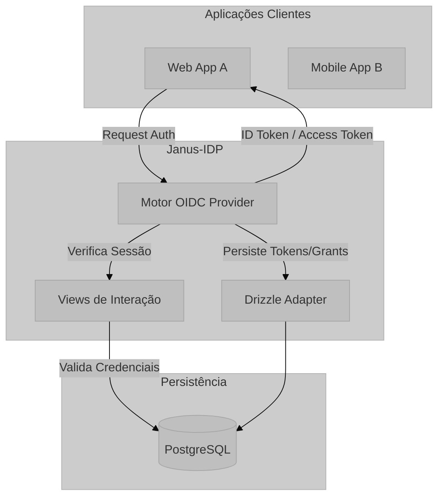

# Visão Geral e Propósito: Janus-IDP

O sistema **Janus-IDP** (Identity Provider) é uma solução de gerenciamento de identidade e acesso (IAM - Identity and Access Management) desenvolvida para atuar como um servidor centralizado de autenticação e autorização. Ele implementa os protocolos modernos **OpenID Connect (OIDC)** e **OAuth 2.0**, permitindo que aplicações terceiras (Clients) deleguem a verificação de identidade de seus usuários de forma segura.

## Propósito do Módulo

O propósito central do Janus-IDP é prover uma camada de abstração entre o usuário final e os recursos protegidos. Ele resolve o problema de fragmentação de credenciais, onde o usuário precisaria de múltiplas contas para diferentes serviços. Como um IDP, ele oferece:

1.  **Autenticação Centralizada (SSO):** O usuário autentica-se uma única vez e obtém acesso a múltiplos sistemas autorizados.
2.  **Autorização Granular (RBAC):** Controle de acesso baseado em papéis globais e papéis por cliente, com o `sub` como identificador estável do usuário.
3.  **Segurança de Dados:** Armazenamento seguro de segredos e emissão de tokens assinados criptograficamente.

## Arquitetura de Alto Nível

A arquitetura baseia-se em um modelo de **Federação de Identidade**, onde o Janus atua como a Autoridade Confiável (*Trusted Authority*).

## Fundamentação Matemática e Criptográfica

O sistema baseia-se na criptografia de chave pública para garantir a integridade e autenticidade dos tokens emitidos. A assinatura dos tokens JWT (JSON Web Tokens) utiliza o algoritmo **RS256** (RSA Signature with SHA-256).

A segurança da senha é garantida por funções de derivação de chave (KDF), tipicamente o **Bcrypt** ou **Argon2**, onde a probabilidade de colisão e resistência a ataques de força bruta são definidas por:

$$ P(	ext{crack}) = \frac{1}{2^n \cdot C} $$

Onde $n$ é o comprimento da chave e $C$ é o custo computacional (salt + rounds).

## Mapeamento Tecnológico

*   **Runtime:** Node.js (TypeScript).
*   **Protocolo Core:** `oidc-provider` (v9.x).
    *   [Documentação Oficial](https://github.com/panva/node-oidc-provider)
*   **ORM:** Drizzle ORM.
    *   [Documentação Oficial](https://orm.drizzle.team/)
*   **Segurança:** JWT, JWKS, OAuth 2.0, OIDC.

## Justificativa de Escolha

A escolha do `oidc-provider` justifica-se por ser uma implementação certificada pelo OpenID Foundation, garantindo conformidade estrita com as RFCs. O uso do Drizzle ORM permite uma interface *type-safe* com o banco de dados, reduzindo erros em tempo de execução e otimizando a performance em relação a ORMs baseados em introspecção em tempo de execução.
