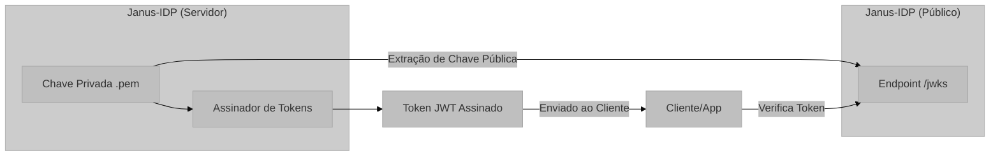

# Parâmetros Técnicos e Segurança: Gestão de Chaves e Criptografia

Este documento detalha os mecanismos de segurança aplicados no Janus-IDP, focando na gestão de segredos, assinaturas e cabeçalhos de segurança.

## Visão Geral e Propósito do Módulo de Segurança

A segurança do Janus-IDP é o pilar central que sustenta a confiança entre Usuários, Clientes e o Provedor de Identidade. Este módulo gerencia a persistência de senhas (hashing) e a integridade de tokens (assinatura digital).

## Arquitetura e Lógica: Gestão de Chaves (JWKS)

O Janus-IDP utiliza o padrão **JWKS (JSON Web Key Set)** para expor suas chaves públicas de assinatura. As chaves privadas permanecem no servidor, enquanto as públicas são acessíveis via `/jwks`.

## Fundamentação Matemática: Algoritmos de Assinatura

O Janus-IDP utiliza **RSA** (Rivest–Shamir–Adleman) com o esquema de assinatura **RS256**. O processo de assinatura ($S$) de um dado ($M$) utiliza a chave privada $(d, n)$:

$$ S = M^d \pmod n $$

A verificação pelo cliente utilizando a chave pública $(e, n)$ garante que:

$$ M = S^e \pmod n $$

Onde $e$ é tipicamente $65537$ e $d$ é o inverso modular de $e \pmod{\phi(n)}$.

## Parâmetros Técnicos: Cabeçalhos e Proteção de Sessão

O sistema implementa múltiplas camadas de proteção:

1.  **Helmet.js:** Configura cabeçalhos HTTP de segurança como `X-Frame-Options` e `X-Content-Type-Options`.
2.  **Trust Proxy:** Habilitado para ler corretamente os cabeçalhos `X-Forwarded-Proto` e `X-Forwarded-For` em ambientes Docker/Reverse Proxy.
3.  **Cookies Seguros:**
    -   `httpOnly: true`: Impede acesso ao cookie via JavaScript (proteção contra XSS).
    -   `secure: true` (em produção): Garante tráfego apenas via HTTPS.
    -   `sameSite: 'lax'`: Proteção contra ataques CSRF (Cross-Site Request Forgery).

## Mapeamento Tecnológico e Referências

*   **Hashing de Senhas:** `bcryptjs`.
    *   [Documentation](https://www.npmjs.com/package/bcryptjs)
*   **Gestão de Chaves:** `jose` (biblioteca para manipulação de JWK/JWT).
*   **Referência Acadêmica:** Rivest, R. L., Shamir, A., & Adleman, L. (1978). *A method for obtaining digital signatures and public-key cryptosystems*. Publicado em "Communications of the ACM". Este é o artigo seminal que define o algoritmo RSA utilizado pelo sistema.
*   **Segurança HTTP:** [OWASP Top 10 Reference](https://owasp.org/www-project-top-ten/).

## Justificativa de Escolha

A escolha do algoritmo **RS256** justifica-se por ser o padrão de mercado mais compatível para assinaturas OIDC. Embora algoritmos baseados em Curva Elíptica (como ES256) sejam mais eficientes computacionalmente para o mesmo nível de segurança, o RSA oferece a maior interoperabilidade com bibliotecas de cliente legadas e modernas em diversas linguagens de programação.
